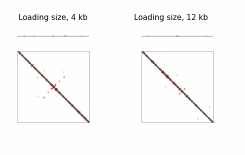

# Target chromatin loop extrusion with dynamic boundaries



**Illustration**: This gif shows how extruders (yellow) load onto chromatin at target loci and begin extrusion, forming features in Hi-C contact maps under different scenarios. In the right panel, a wider loading region (indicated in blue) causes a ‘boundary’ to appear in the Hi-C contact map due to collisions between extruders that act as a ‘barrier’. In contrast, the scenario on the left produces a ‘fountain’-like pattern.
<!--
- **Left**: Lattice model showing a simulated genomic region (grey) with a long-lived barrier acting as an anchor (left site, red) and multiple downstream dynamic barrier positions (right three sites, red). The two genomic positions held together by the extruder is depicted with a light arch. If a barrier becomes unbound, an extruder blocked at this site can continue extruding. Note that CTCF can re-bind when the barrier is inside of an extruded loop.
- **Right**: The consequence on 3D genome organization.-->

### Description
This GitHub repository contains tools for simulating chromatin loop extrusion with targeted loading loci for extruders, using a dynamic model of CTCF. 

Preprint available here: <>


### Structure of the repository
The structure of this repository follows as below:
- Analysis: notebooks and code for analyzing simulations and experimental data. This includes:  
  - Target Cohesin Loading: Single site, multiple site, domains targets, and target loading with association rate  
  - Sequential Barriers: Tandem configuration of barriers  
  - Realistic Distribution of Barriers: Different scenarios with the random and regular configuration of barriers   
- Scripts: codes for performing simulations, and quantitative analysis.
- Target_Cohesin_Loading: accessory scripts for the simulations
  
### Requirements
- *Polychrom*: A toolkit for polymer simulations. (https://github.com/open2c/polychrom)
- *OpenMM*: A library for molecular simulations. (https://github.com/openmm/openmm)
- *Open2C* analysis packages (see https://github.com/open2c)
- *Chromoscores* analysis package for Hi-C maps (see https://github.com/hrahmanin/chromoscores)

  
## Installation
First, 

```
git clone https://github.com/Fudenberg-Research-Group/Target_cohesin_loading.git
```
after navigating to the folder:
```
pip install -e .
```

### Workflow
#### Running simulations 
See `./scripts` for relevant code. 
1. One-Dimensional Lattice Simulation: Parameters such as the lifetime, velocity, and density of extruders can be adjusted in the configuration file located at `scripts/simulation.py`. The target loading size and the loading rate relevant to the other sites can be determined. Barriers are specified as dynamic barriers, and their parameters such as binding time, unbound time, and/or the occupancy can be adjusted. 

2. Run the coarse-grained molecular dynamics simulations to model loop extrusion. Uses extruder positions from 1D lattice simulations as an input. 

#### Processing simulation data
After running the simulations, the simulated trajectories can be processed to generate *in silico* ChIP-seq profiles, and contact maps. Scripts for data processing available in notebooks in`./Analysis`. Instructions are provided with the relevant python code.

#### Analysis
Once the data is processed, observable features can be quantified, including:

- FRiP (Fraction of Reads in Peaks)
<!---- TADs (Topologically Associating Domains)
- Dots (loops between barriers)
- Vermicelli (accumulation of extruders on axial structures)
- P(s): contact frequency vs genomic distance-->
  
See Jupyter notebooks in `./Analysis`.


